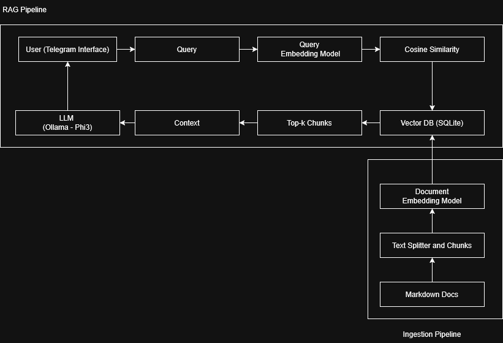
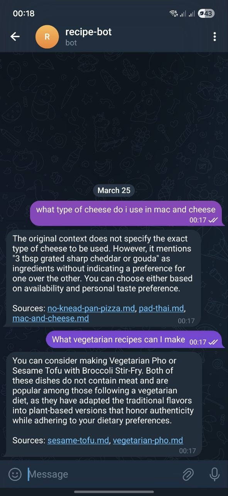

# Description

A lightweight Retrieval-Augmented Generation (RAG) system that uses MiniLM embeddings + SQLite + cosine similarity for retrieval and a local Ollama LLM (Phi-2) for answer generation.
The system is exposed via a simple Telegram bot interface.


## Prerequisites
Install Ollama (local LLM server):

```
curl -fsSL https://ollama.com/install.sh | sh
ollama pull phi3
```
Refer: https://ollama.com

## Docker Setup

Build the image  
```
docker build -t rag-bot .
```  
Run the container  
```
docker run --network=host \
-e TELEGRAM_BOT_TOKEN=your_token_here \
rag-bot
```
## Models Used
Text Generation: Phi-2 (via Ollama)  
Embeddings: all-MiniLM-L6-v2  
## Data Flow

## Demo
